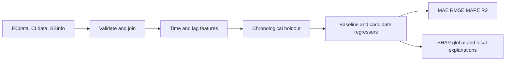

# EcoCell-AI: Energy Prediction for 5G Base Stations

## Overview
EcoCell-AI studies regression-based prediction of 5G base-station energy consumption. It combines observed energy readings with cell load, energy-saving mode indicators, radio metadata, and time features. The cleaned pipeline uses a chronological holdout so evaluation reflects forecasting on later observations. The original CSV datasets and historical submission files are preserved.

## Problem Statement
Given a base station, timestamp, cell measurements, and static radio metadata, predict the continuous `Energy` value. This is a regression problem, not a classification problem. The existing submission files contain predictions for future rows but no corresponding ground truth, so their test performance is not reported.

## Dataset
- `ECdata.csv`: labeled energy observations and the target `Energy`.
- `CLdata.csv`: timestamped cell load and energy-saving mode indicators.
- `BSinfo.csv`: base-station metadata including `RUType`, `Mode`, frequency, bandwidth, antennas, and transmit power.
- `submission_*.csv`: historical prediction artifacts from the source project; not used as labeled evaluation data.

The source tables contain 92,629 labeled energy rows. The pipeline uses `Cell0`, matching the original notebooks, and validates the source columns and one-to-one feature joins.

## Approach


Target-derived energy lags are intentionally excluded because future submission rows do not contain observed energy. Load and energy-saving-mode lags are retained because they are available input measurements.

## Models
- Mean predictor baseline.
- Ridge regression with one-hot categorical encoding.
- ExtraTrees regression.
- HistGradientBoosting regression.
- Lightly tuned HistGradientBoosting regression, selecting among three small parameter configurations on an inner chronological split.

## Results
Results below are from the 20% chronological holdout generated by `src/train.py`, with 82,949 training rows and 9,680 later validation rows.

| Model | MAE | RMSE | MAPE | R2 |
|---|---:|---:|---:|---:|
| Tuned HistGradientBoosting | 1.900004 | 2.646730 | 6.803583% | 0.964758 |
| ExtraTrees | 1.935885 | 2.856705 | 6.673203% | 0.958944 |
| Ridge | 1.955779 | 2.767578 | 7.474955% | 0.961466 |
| HistGradientBoosting | 1.999434 | 2.757460 | 7.174731% | 0.961747 |
| Mean baseline | 10.978056 | 14.184752 | 43.167025% | -0.012252 |

These are holdout metrics, not scores on the unlabeled submission rows.

## Explainability
SHAP TreeExplainer is applied to the saved tuned tree model after preprocessing. The generated global ranking places `RUType`, `load`, `Antennas`, `TXpower`, and `BS` among the largest mean absolute contributions. These values indicate predictive influence, not causation. The local waterfall plot explains one sampled observation and shows which transformed features move its prediction above or below the model baseline.

## Project Structure
- `src/data_preprocessing.py`: loading, validation, joins, feature construction, and chronological splitting.
- `src/train.py`: model comparison, lightweight tuning, metrics, and saved artifacts.
- `src/evaluate.py`: regression metrics and residual plots.
- `src/eda.py`: summaries and basic distribution plots.
- `src/explain.py`: SHAP global and local explanations.
- `notebooks/`: small entry-point notebooks for exploration, training, and explainability.
- `data/README.md`: source-table documentation.
- `results/`: generated metrics and figures; model and plots are ignored by Git.

## Installation
From the project root:

```bash
python -m pip install -r requirements.txt
```

## Usage
Run the reproducible pipeline:

```bash
python -m src.eda
python -m src.train
python -m src.explain
```

Or open the three notebooks in order. Run notebooks from the project root so the `src` package is importable.

## Technologies
Python, Pandas, NumPy, scikit-learn, Matplotlib, Seaborn, SHAP, Joblib, and Jupyter.

## Future Improvements
- Evaluate on a separately released labeled future period.
- Use a station-aware generalization study for unseen base stations.
- Add prediction intervals for operational planning.
- Compare a leakage-safe rolling-origin evaluation with the single holdout.
- Investigate whether station identity should be replaced with more general physical descriptors.

## Attribution and license
This checkout originated from the GitHub project [satishchauhan108/EcoCell-AI](https://github.com/satishchauhan108/EcoCell-AI). Review and retain the upstream repository's license and attribution requirements before publishing a derivative version. The original notebooks and submission artifacts are retained rather than presented as wholly original authorship.